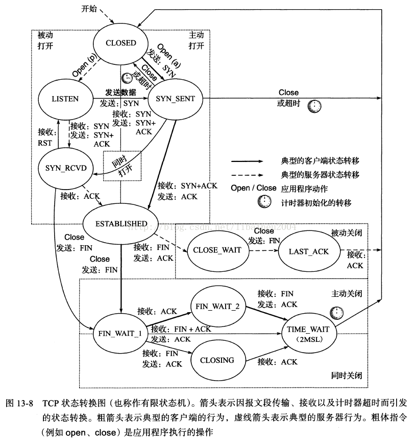
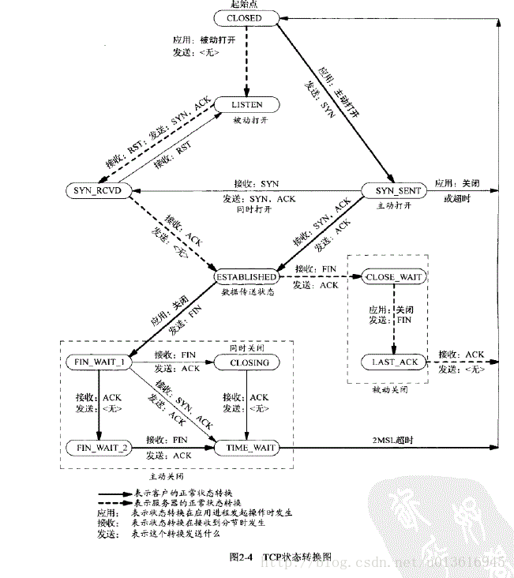

- #card #Network 问题【模板】
  template:: network
	- 答案
- #card #Network TIME_WAIT是如何产生的，如何避免？
  card-last-interval:: 4
  card-repeats:: 1
  card-ease-factor:: 2.6
  card-next-schedule:: 2022-09-25T01:19:05.405Z
  card-last-reviewed:: 2022-09-21T01:19:05.406Z
  card-last-score:: 5
	- 状态转换图
		- {:height 662, :width 537}
		- 
	- 产生的原因
		- ^^首先调用close()发起主动关闭的一方，在发送最后一个ACK之后会进入time_wait的状态，也就说该发送方会保持2MSL时间之后才会回到初始状态。MSL值得是数据包在网络中的最大生存时间。产生这种结果使得这个TCP连接在2MSL连接等待期间，定义这个连接的四元组（客户端IP地址和端口，服务端IP地址和端口号）不能被使用。^^
		- 为什么会这样？
		  collapsed:: true
			- 1）为实现TCP全双工连接的可靠释放
				- 让4次握手关闭流程更加可靠；4次握手的最后一个ACK是是由主动关闭方发送出去的，若这个ACK丢失，被动关闭方会再次发一个FIN过来。若主动关闭方能够保持一个2MSL的TIME_WAIT状态，则有更大的机会让丢失的ACK被再次发送出去。
			- 2）为使旧的数据包在网络因过期而消失
				- 防止lost duplicate对后续新建正常链接的传输造成破坏。lost duplicate在实际的网络中非常常见，经常是由于路由器产生故障，路径无法收敛，导致一个packet在路由器A，B，C之间做类似死循环的跳转。IP头部有个TTL，限制了一个包在网络中的最大跳数，因此这个包有两种命运，要么最后TTL变为0，在网络中消失；要么TTL在变为0之前路由器路径收敛，它凭借剩余的TTL跳数终于到达目的地。但非常可惜的是TCP通过超时重传机制在早些时候发送了一个跟它一模一样的包，并先于它达到了目的地，因此它的命运也就注定被TCP协议栈抛弃。另外一个概念叫做incarnation connection，指跟上次的socket pair一摸一样的新连接，叫做incarnation of previous connection。lost duplicate加上incarnation connection，则会对我们的传输造成致命的错误。大家都知道TCP是流式的，所有包到达的顺序是不一致的，依靠序列号由TCP协议栈做顺序的拼接；假设一个incarnation connection这时收到的seq=1000, 来了一个lost duplicate为seq=1000, len=1000, 则tcp认为这个lost duplicate合法，并存放入了receive buffer，导致传输出现错误。通过一个2MSL TIME_WAIT状态，确保所有的lost duplicate都会消失掉，避免对新连接造成错误。
				  ————————————————
				  原文链接：https://blog.csdn.net/yusiguyuan/article/details/38984759
	- 如何避免
		- 首先服务器可以设置SO_REUSEADDR套接字选项来通知内核，如果端口忙，但TCP连接位于TIME_WAIT状态时可以重用端口。在一个非常有用的场景就是，如果你的服务器程序停止后想立即重启，而新的套接字依旧希望使用同一端口，此时SO_REUSEADDR选项就可以避免TIME_WAIT状态。
		- Q: 编写 TCP/SOCK_STREAM 服务程序时，SO_REUSEADDR到底什么意思？
			- A: 这个套接字选项通知内核，如果端口忙，但TCP状态位于 TIME_WAIT ，可以重用端口。如果端口忙，而TCP状态位于其他状态，重用端口时依旧得到一个错误信息，指明"地址已经使用中"。如果你的服务程序停止后想立即重启，而新套接字依旧使用同一端口，此时 SO_REUSEADDR 选项非常有用。必须意识到，此时任何非期望数据到达，都可能导致服务程序反应混乱，不过这只是一种可能，事实上很不可能。
	- 更详细的内容可参考文章： https://blog.csdn.net/huangyimo/article/details/81505558
	  card-last-interval:: 4
	  card-repeats:: 1
	  card-ease-factor:: 2.6
	  card-next-schedule:: 2022-09-25T01:19:05.405Z
	  card-last-reviewed:: 2022-09-21T01:19:05.406Z
	  card-last-score:: 5
-