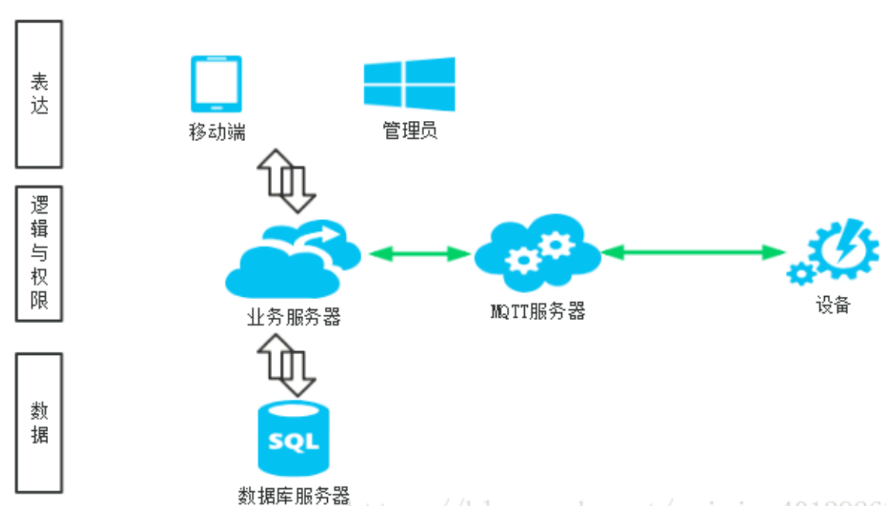
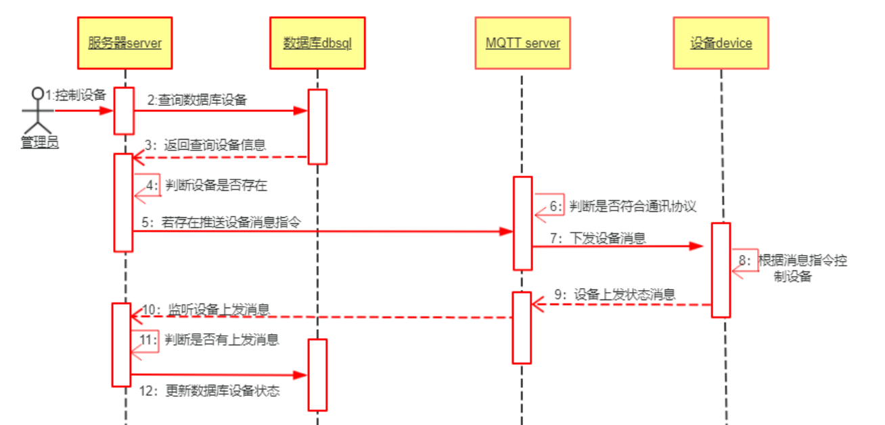

- #card #中间件 [[MQTT]]介绍及工作原理
  card-last-score:: 5
  card-repeats:: 1
  card-next-schedule:: 2022-08-23T07:41:18.654Z
  card-last-interval:: 4
  card-ease-factor:: 2.6
  card-last-reviewed:: 2022-08-19T07:41:18.656Z
	- MQTT协议运行在TCP/IP或其他网络协议，提供有序、无损、双向连接。其特点包括：
	  collapsed:: true
		- 1使用的发布/订阅消息模式，它提供了一对多消息分发，以实现与应用程序的解耦。
		- 2对负载内容屏蔽的消息传输机制。
		- 3对传输消息有三种服务质量（QoS）：
			- 最多一次，这一级别会发生消息丢失或重复，消息发布依赖于底层TCP/IP网络。即：<=1
			- 至多一次，这一级别会确保消息到达，但消息可能会重复。即：>=1
			- 只有一次，确保消息只有一次到达。即：＝1。在一些要求比较严格的计费系统中，可以使用此级别
		- 4数据传输和协议交换的最小化（协议头部只有2字节），以减少网络流量
		- 5通知机制，异常中断时通知传输双方
		- 6使用 Last Will 和 Testament 特性通知有关各方客户端异常中断的机制；
	- MQTT协议实现方式
	  collapsed:: true
		- 
		- 实现MQTT协议需要：客户端和服务器端
		- MQTT协议中有三种身份：发布者（Publish）、代理（Broker）（服务器）、订阅者（Subscribe）。其中，消息的发布者和订阅者都是客户端，消息代理是服务器，消息发布者可以同时是订阅者。
		- MQTT传输的消息分为：主题（Topic）和负载（payload）两部分
			- Topic，可以理解为消息的类型，订阅者订阅（Subscribe）后，就会收到该主题的消息内容（payload）
			- payload，可以理解为消息的内容，是指订阅者具体要使用的内容
	- 网络传输与应用消息
	  collapsed:: true
		- MQTT会构建底层网络传输：它将建立客户端到服务器的连接，提供两者之间的一个有序的、无损的、基于字节流的双向传输。
		- 当应用数据通过MQTT网络发送时，MQTT会把与之相关的服务质量（QoS）和主题名（Topic）相关连。
	- 客户端与服务端
	  collapsed:: true
		- MQTT客户端
			- 一个使用MQTT协议的应用程序或者设备，它总是建立到服务器的网络连接。客户端可以：
				- 发布其他客户端可能会订阅的信息
				- 订阅其它客户端发布的消息
				- 退订或删除应用程序的消息
				- 断开与服务器连接
		- MQTT服务端
			- MQTT服务器以称为“消息代理”（Broker），可以是一个应用程序或一台设备。它是位于消息发布者和订阅者之间，它可以：
				- 接受来自客户的网络连接
				- 接受客户发布的应用信息
				- 处理来自客户端的订阅和退订请求
				- 向订阅的客户转发应用程序消息
			- 
			- 