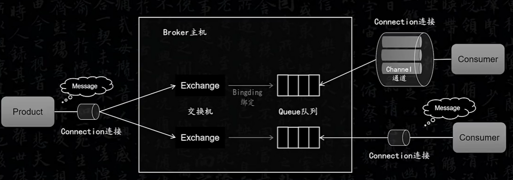

- #card 对 #RabbitMQ 工作原理的理解
  template:: 中间件
	- 核心组件
	  	Product生产者
	  	Consumer消费者
	  	Broker 代理、或者中介
	  	Connection
	  	Channel
	  	Queue
	  	Exchange
	  	Binding
	  	VHost虚拟主机，类似于Namespace
	- 工作原理
		- 
		- Broker是Product和Consumer之间的纽带，相当于一个用于生产者和消费者之间产生，消费消息的消息工厂。
		- Connection是生产者和消费者与Broker之间建立的连接
		- Channel是在Connection上建立的虚拟连接，在一个长连接上可以隔离地创建多个Channel，不同的Channel有不同的编号，所有接口都是在Channel基础上的
		- Queue：队列是在Channel上产生和消费消息的队列，用来存储消息
		- Exchange是用于消息转发的交换机，相当于消息路由，只是根据规则来分发消息，不会存储消息
		- Binding 绑定关系：Exchange和Queue必须要建立一个绑定关系。每个队列都要指定一个特定的RoutingKey
		- Exchange和队列 是多对多的关系，一个交换机的消息可以路由给多个队列，一个队列也可以接收来自多个交换机的消息。
		- 生产者发送消息到Exchange时也会带RoutingKey，当这个RoutingKey和队列匹配时，就会发给一个或者多个队列。
		- VHost用于资源隔离和权限控制